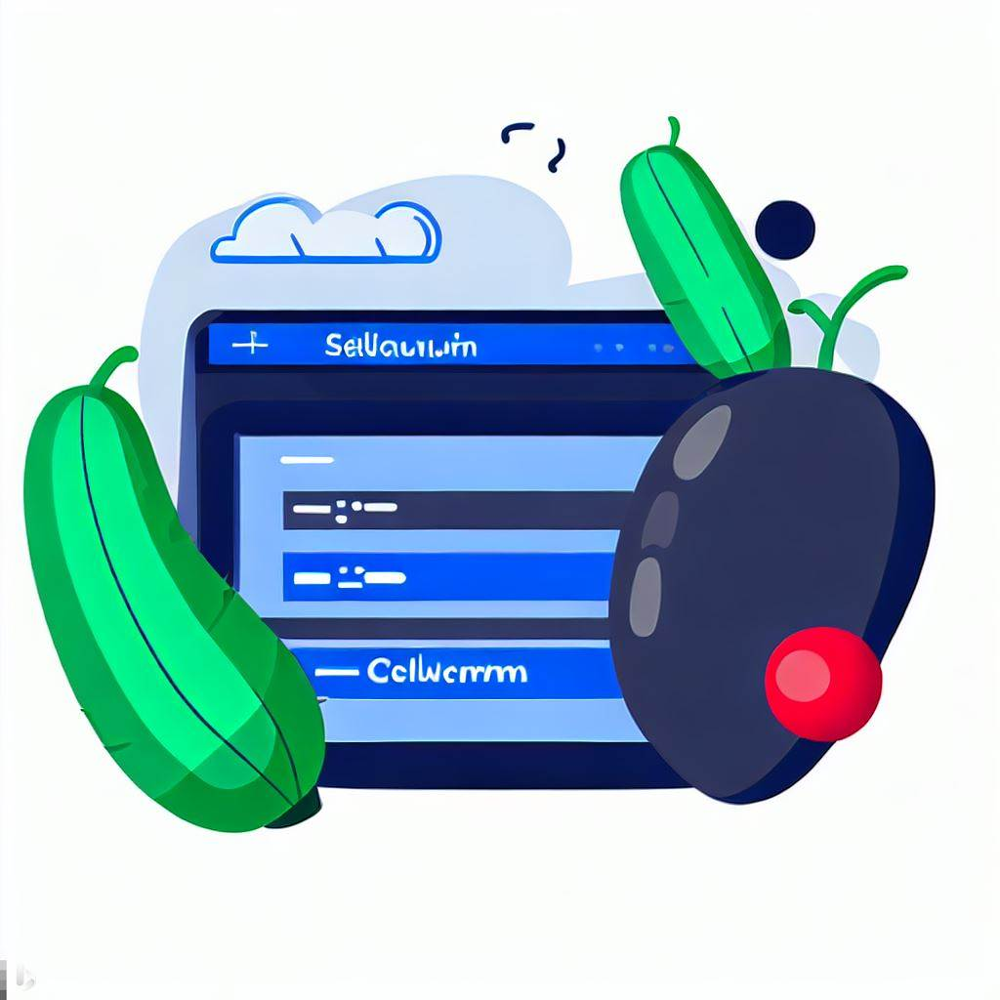

# SeleniumSynergySuite

<p align="center">
  
</p>

This repository contains a comprehensive test automation framework built with Selenium WebDriver, Java, Cucumber, and JUnit. The framework is designed to facilitate the creation and execution of automated tests for web applications, allowing for efficient and reliable software testing.

Ongoing development: Adding new features and continuous improvements to this framework.

## Features

- Utilizes Selenium WebDriver for browser automation.
- Implements Behavior-Driven Development (BDD) approach using Cucumber.
- Uses JUnit as the test runner.
- Generates Cucumber reports for detailed test results.
- Supports easy creation and maintenance of test scenarios using Gherkin syntax.
- Provides reusability and modularity through page object model (POM) design pattern.
- Offers flexibility to add custom step definitions and hooks for test setup and teardown.

## Getting Started

To get started with the SeleniumSynergySuite framework, follow these steps:

1. Clone the repository:

   ```shell
   git clone https://github.com/sagar-kulkarni-git/SeleniumSynergySuite.git

2. Install the necessary dependencies using a build tool like Maven.

3. Set up your test scenarios by writing feature files in Gherkin syntax. Place the feature files under the src/test/resources/appFeatures directory.

4. Implement the step definitions for your scenarios using Java in the src/test/java/stepsdefinitions package.

5. Execute the tests by running the JUnit runner class src/test/java/testrunners/MyTestRunner.java.

6. After executing the tests, To view the generated Cucumber reports please follow the path mentioned on console to view HTML Cucumber Test Execution Report.

## Contributing
Contributions are welcome! If you find any issues or have suggestions for improvements, please open an issue or submit a pull request.

## License

This project is licensed under the [Apache License, Version 2.0](https://www.apache.org/licenses/LICENSE-2.0).
